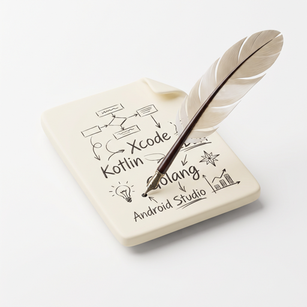
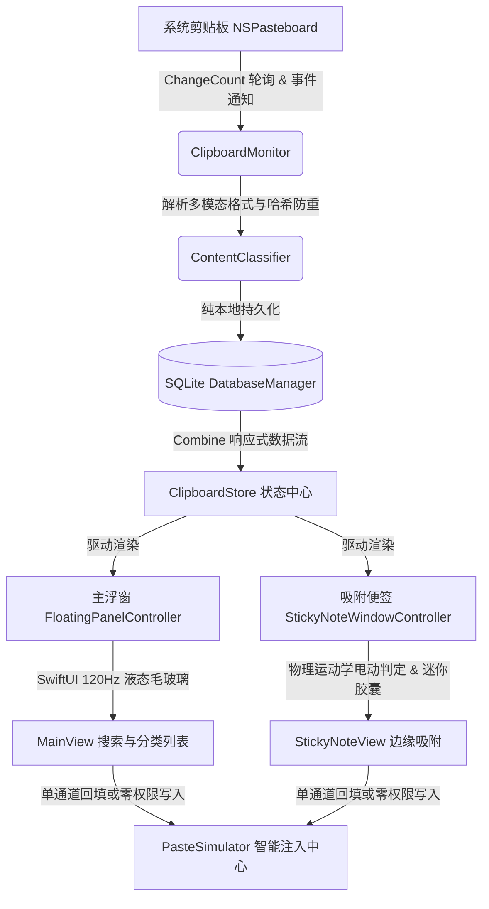

<p align="center">
  
</p>

<h1 align="center">AwesomeBar</h1>

<p align="center">
  <strong>专为 macOS 打造的原生极致灵动剪贴板管理神器</strong><br>
  <em>Ultra-fast, buttery-smooth & privacy-first native macOS clipboard manager.</em>
</p>

<p align="center">
  
  
  
  
  
  
</p>

---

## ✨ 核心特性 (Key Features)

### 🌊 1. 极致原生液态毛玻璃界面 (Liquid Glass UI)
- **纯色无渐变极简美学**：采用 Apple 原生 `NSVisualEffectView` 深度定制，浅色纯净白透，深色深邃高级。
- **120Hz ProMotion 硬件加速**：支持 MacBook Pro 120Hz 高刷新率屏幕，异步图层绘制与 GPU 硬件圆角裁剪，彻底杜绝掉帧与撕裂。
- **中文输入法 (IME) 智能防冲**：处于拼音/日文等输入法组合态（Marked Text）时自动放行，绝不误拦截回车、空格与数字选词。

### 🧲 2. 物理运动学边缘甩动吸附 & 迷你胶囊 (Kinematic Edge Docking)
- **物理运动学加速度算法**：根据鼠标拖拽释放瞬间的横向速度（Velocity）与加速度（Acceleration）严格判定甩动，普通慢速拖拽悬浮不误触。
- **24 × 84 迷你胶囊提手**：吸附贴边时物理窗口动态缩减为极简小巧的圆角胶囊手柄，占用极少屏幕可视区。
- **0 像素屏幕外溢出**：全屏切换桌面空间（Spaces 3指横划）或进入调度中心（Mission Control）时，窗口 100% 处于可视区边界内，绝不泄漏屏幕外背景白块。
- **Apple 风格 Q 弹插值曲线**：展开与吸附具备微量超调回弹（Overshoot Spring），兼具果冻般的灵动与科技感。

### ⌨️ 3. 物理复合键录制引擎 (Physical Chord Hotkey Engine)
- **多键物理合弦跟踪**：记录从按下第一个按键开始，到松开最后一个按键为止的全部物理按键序列。
- **单键修饰键唤起支持**：支持单击、双击（如双击 `⌥ Option`）或长按单修饰键全局唤起，随心所欲。
- **动态视口 ⌘1~9 快捷直选**：自适应计算滚动视口内当前可见面积 > 2/3 的前 9 条记录并分配数字角标，按快捷键一触即发。

### 🛡️ 4. 双模式粘贴与零权限支持 (Zero-Permission & Auto-Paste)
- **零权限纯复制模式（推荐）**：无需开启 macOS 任何辅助功能权限！点击卡片或按快捷键在 0ms 内将内容注入系统剪贴板，随后随手 `⌘V` 粘贴，永不失效，不受 macOS 系统升级或签名变更影响。
- **全自动模拟粘贴模式**：基于单通道精确 PID 进程注入与防重入防抖互斥锁（Mutex Lock），无多重重复回填，丝滑回填至目标应用。

### 🔍 5. 多模态内容智能识别 (Multimodal Intelligence)
- **全格式自动分类**：纯文本、富文本（RTF）、多行代码片段、图片、本地文件、网页 URL、十六进制/RGB 色彩实时解析。
- **色彩预览与格式化**：检测到 Hex 色值自动渲染色彩胶囊，支持一键切换 RGB、HSL 与 Hex 格式。
- **代码语法自动识别**：智能检测 JSON、Python、Swift、JavaScript 等常见代码格式并高亮排版。
- **原生 QuickLook 空格键预览**：选中卡片按下空格键（Spacebar），立即唤起系统级全尺寸图片与文件大图预览。

### 🔒 6. 纯本地隐私安全存储 (100% Local-First SQLite)
- **纯本地 SQLite 驱动**：所有剪贴板数据与图片缩略图均加密存储在本地沙盒目录中。
- **完全零网络请求**：无需注册、无需联网、0 数据上传，彻底守护个人密码与机密代码安全。

---

## 📸 界面预览 (Screenshots)

| 主卡片全量搜索模式 | 独立小粘贴板浮窗 | 边缘迷你胶囊吸附态 |
| :---: | :---: | :---: |
| 实时多模态检索与快捷键直选 | 纯净无干扰便签形态 | 贴边 24x84 毛玻璃提手 |

---

## 🚀 快捷键速查表 (Shortcut Cheat Sheet)

| 场景 / 触发动作 | 默认快捷键 | 功能说明 |
| :--- | :--- | :--- |
| **全局呼出/隐藏主面板** | `⌥ + 空格` *(可自定义)* | 瞬间唤起液态玻璃剪贴板搜索栏 |
| **呼出独立小粘贴板** | `⌃ + ⌥ + V` *(可自定义)* | 唤起可吸附、可置顶的轻量迷你便签窗口 |
| **动态序号直接复制** | `⌘1` ~ `⌘9` *(可自定义)* | 复制当前视口内高亮标记的对应序号条目 |
| **大图与文件全尺寸预览** | `空格 Space` | 呼出原生 macOS QuickLook 预览大图 |
| **条目置顶 / 收藏** | `⌘P` 或 点击图钉 | 将重要条目锁定在列表顶端，永不被覆盖 |
| **删除条目** | `⌫ Backspace` / `⌘D` | 从数据库与本地缓存中彻底移除条目 |
| **退出 / 收起** | `Esc` | 隐藏当前浮窗并自动交还前台应用焦点 |

---

## 🛠️ 构建与安装指南 (Build & Install)

### 环境要求 (Prerequisites)
* macOS 14.0 (Sonoma) 或更高版本
* Xcode 15.0+ / Swift 5.9+

### 从源码编译 (Build from Source)

1. **克隆本仓库**：
   ```bash
   git clone https://github.com/HuangZhuoRui/AwesomeBar.git
   cd AwesomeBar
   ```

2. **使用 Xcode 打开工程**：
   ```bash
   open AwesomeBar.xcodeproj
   ```

3. **使用命令行极速编译**：
   ```bash
   xcodebuild -project AwesomeBar.xcodeproj -scheme AwesomeBar -destination "platform=macOS" -derivedDataPath .build/DerivedData build
   ```
   编译完成的 `.app` 文件位于 `.build/DerivedData/Build/Products/Debug/AwesomeBar.app`。

---

## 🧩 系统架构设计 (Architecture)



---

## 📄 开源许可证 (License)

本项目采用 [MIT License](LICENSE) 开源许可证。欢迎提交 Issue 与 Pull Request 共同打造极致的 macOS 剪贴板体验！
